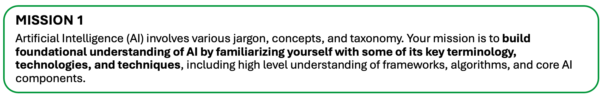

# 第一課：生成式人工智慧（Generative Artificial Intelligence, AI）基礎

## AI 入門
作為 GenAI（生成式人工智慧）實踐者，你需要至少理解下列術語的意義，並能夠說明相關概念。以下不是完整列表，目的是幫助你入門。詳細內容請參考各種資源。下列內容摘自網路資源彙整。

### 什麼是 AI？與 GenAI 有何不同？
人工智慧（AI, Artificial Intelligence）指的是在機器中模擬人類智慧。AI 系統旨在執行通常需要人類智慧的任務，例如學習、解決問題、推理、理解語言和感知。

AI 有許多子類別，例如機器學習（Machine Learning）、深度學習（Deep Learning）等。

生成式人工智慧（Generative AI）是 AI 的一種，專注於創造新內容，例如文字、圖像、音樂甚至程式碼。它通常基於深度學習的進階模型，產生類似人類創作的資料。

### 什麼是 LLM？
LLM（大型語言模型, Large Language Model）是一種人工智慧系統，訓練於大量文本資料，能理解、生成和處理人類語言。其基於深度學習神經網路，特別是 Transformer（變壓器）架構，能以複雜方式處理與預測語言。訓練資料來自書籍、網站、文章等，模型會學習文字間的語法、語意、上下文與關聯。

雖然功能強大，LLM 有時會產生不正確資訊（幻覺，Hallucination）、展現訓練資料中的偏見，並且不像人類一樣真正理解語言。

總結來說，LLM 是機器學習（Machine Learning）的專門應用，聚焦於自然語言任務，而 ML 涵蓋範圍更廣。

### 什麼是 SLM？
SLM（小型語言模型, Small Language Model）是一種設計用於自然語言處理的人工智慧模型，參數數量較少（數百萬到數十億），運算需求也比大型語言模型低。

**參數規模範例**
- 小型語言模型：1 億到 10 億參數
- 中型模型：10 億到 100 億參數
- 大型模型（如 GPT-3）：1750 億參數
- 超大型模型：5000 億到 1 兆參數

### 什麼是 ML？
機器學習（Machine Learning）是人工智慧的一個分支，專注於建立能從經驗學習並自我改進的系統，而無需明確程式設計。ML 讓電腦能辨識模式，並根據資料做出決策或預測。

### AI 中的幻覺（Hallucination）是什麼意思？
AI 的幻覺指的是模型產生錯誤、不準確或完全捏造的資訊，即使聽起來很可信。就像 AI「想像」出不存在或訓練資料未支持的內容。

例如，你詢問 AI 關於一位「Olivia Smith」，它可能自信地生成一份詳細的傳記，包括出生日期與成就，但其實這不是指某位真實人物，而是將訓練過程中學到的模式組合起來。

### AI 中「token」的意思是什麼？
在 AI 中，token 指的是一個基本單位的資料，例如文字、字元或圖像。模型會將輸入資料分解成 token，然後進行處理和分析。
