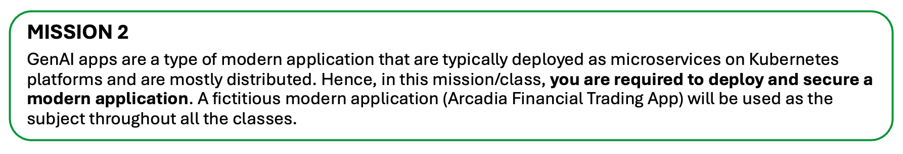
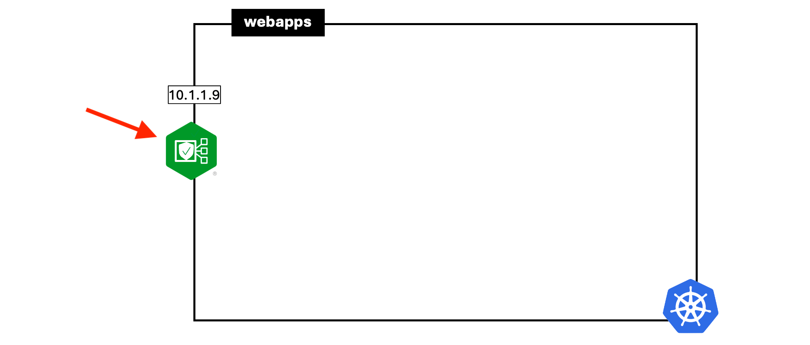
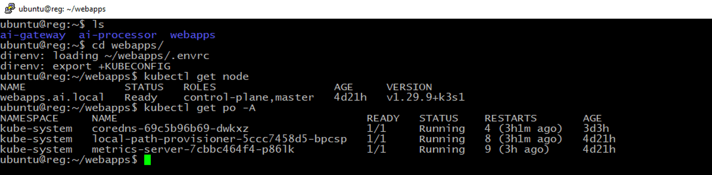

# 第二課：現代應用程式的部署與防護



## 1 - 使用 App Protect 部署 Nginx Ingress Controller (Nginx Ingress Controller) 來保護 Web Apps Server (Web Apps Server)



登入 Linux 跳板機 (Jumphost，可用 putty (putty) 連線，Windows 10 跳板機 (Jumphost) 亦可)，切換目錄至 **webapps**。跳板機已安裝名為 'direnv' 的工具（https://direnv.net/），這是一個當你切換目錄時會自動載入環境檔 (kubeconfig) 的工具。它能有效率地讓你在多個 K8S (Kubernetes) 叢集間切換 context (context)。

> **注意：** 請參考「先決條件 (Prerequisite)」章節，取得 Windows 10 及 Linux 跳板機的密碼。
> 
> 大部分 CLI (CLI) 操作會在 Linux 跳板機執行，瀏覽器操作則在 Windows 10 跳板機。

```bash
cd webapps
```

```bash
kubectl get node
```

```bash
kubectl get po -A
```



執行下列指令，使用提供的 helm chart (helm chart) 安裝 NGINX Ingress Controller：

```bash
cd ~/webapps/nginx-ingress
```

```bash
kubectl create ns nginx-ingress
```

```bash
helm -n nginx-ingress install nginxic \
oci://ghcr.io/nginxinc/charts/nginx-ingress -f values-plus-nap.yaml --version 1.4.0
```
