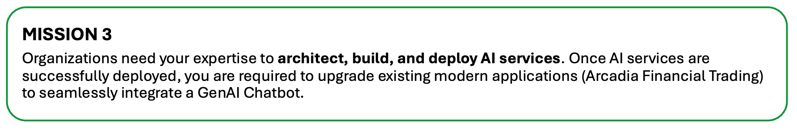
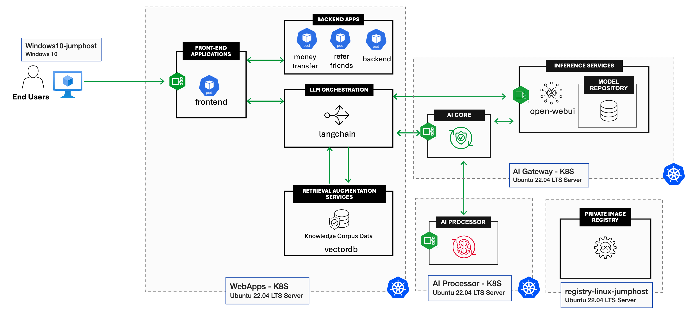
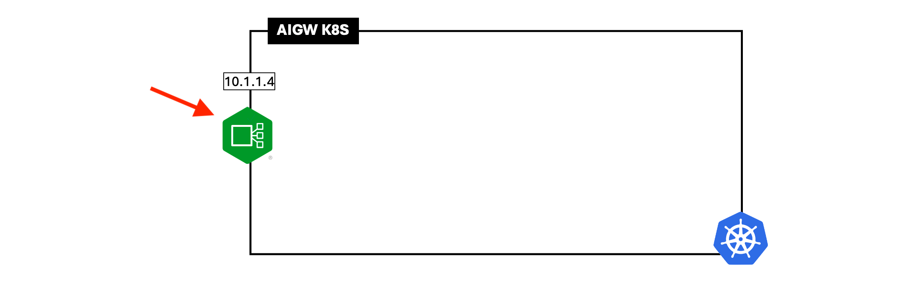

# 第三課：AI 服務的架構、建置與部署



隨著生成式人工智慧（Generative AI, GenAI）日益普及，你的組織決定升級 Arcadia 交易平台，整合 GenAI 聊天機器人（chatbot）。以下是 AI 服務的概念性架構。

> **注意：** 實驗室（Lab）環境將採用共用伺服器，而非每個元件都使用專屬伺服器。

**WebApps - K8S（Kubernetes 叢集）**
- Arcadia 金融現代應用
- Langchain (FlowiseAI)
- 向量資料庫 Vector DB (Qdrant)
- Simply-Chat（簡易 GenAI 聊天機器人前端）

**AI Gateway - K8S**
- AI Gateway Core
- Open WebUI
- Ollama 模型推論服務（Model Inference Service）
- 模型儲存庫（Model Repository）

**AI Processor - K8S**
- AI Gateway Processor

**Registry Linux 跳板機（Jumphost）**
- Harbor Registry 伺服器
- Linux 跳板機

## 1 - AI 服務的概念性架構



## 2 - 為 AI Gateway K8S 部署 Nginx Ingress Controller



```bash
cd ~/ai-gateway/nginx-ingress
```
