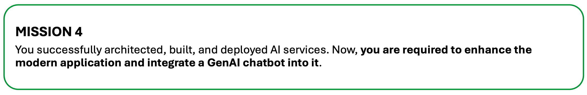
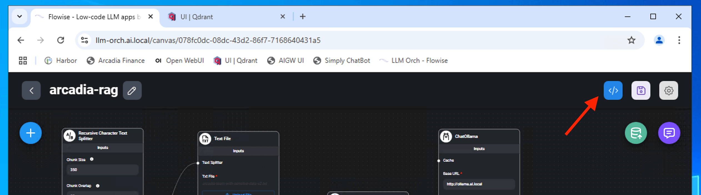
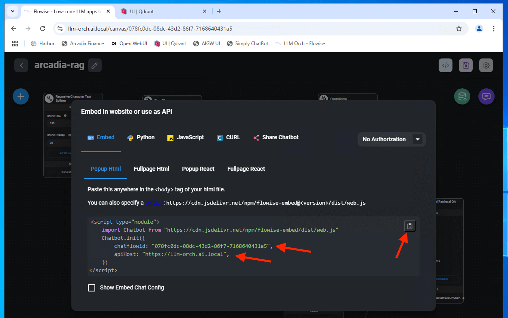
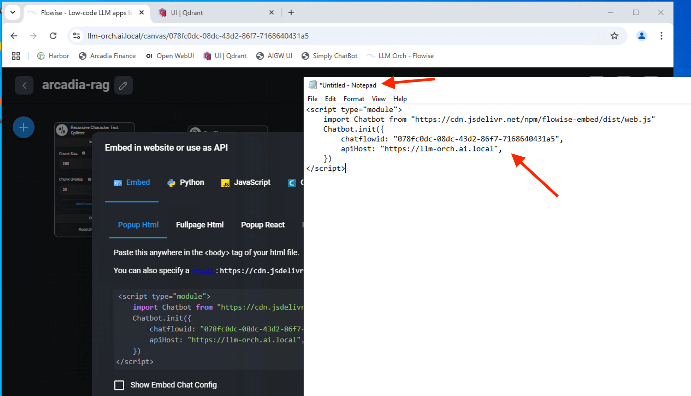
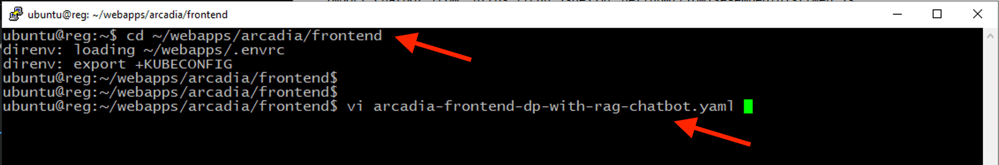
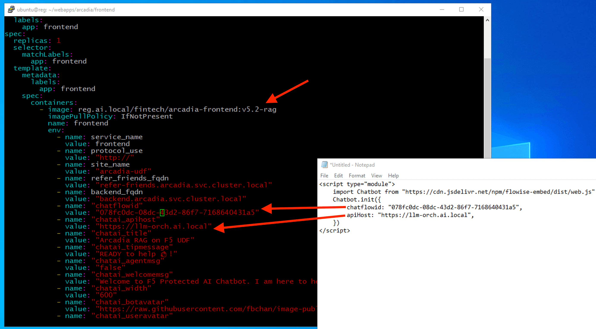

# 第四課：以 GenAI（生成式人工智慧）聊天機器人強化現代應用程式



在上一課中，你已成功利用 langchain（鏈式語言模型）框架與 Flowise AI 建立 GenAI RAG（檢索增強生成）聊天機器人。本課將學習如何將 Flowise 聊天功能整合進 Arcadia（阿卡迪亞）金融應用。

## 1 - 將 AI 服務（RAG 聊天機器人）整合進 Arcadia 交易平台
要將聊天機器人嵌入 Arcadia 交易平台，我們將從 Flowise AI 取得嵌入程式碼片段，並插入到程式中。

從 Flowise AI 複製嵌入碼（embeded code snippet）到文字編輯器。





我們需要在程式碼中使用 **chatflowid**（聊天流程 ID）及 **apihost**（API 主機）。



更新前端應用程式（frontend apps），納入 Flowise 的 **chatflowid** 與 **chatai_apihost**。

> **注意：** 你需要熟悉 vi 編輯器或 Linux 下其他編輯器。每次載入 chatflow 時，"chatflowid" 都會動態變化，需手動更新。**chatai_apihost** 為固定值，指向 langchain API 端點（如 https://llm-orch.ai.local），本實驗室環境即採用該設定。

```bash
cd ~/webapps/arcadia/frontend
```

```bash
vi arcadia-frontend-dp-with-rag-chatbot.yaml
```



更新（如有不同），儲存並離開 vi 編輯器。（提示：按 ESC，然後輸入 :wq）



部署更新後的前端 manifest，該版本已使用不同的前端微服務。
