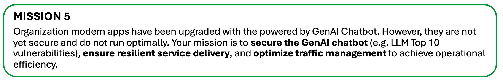
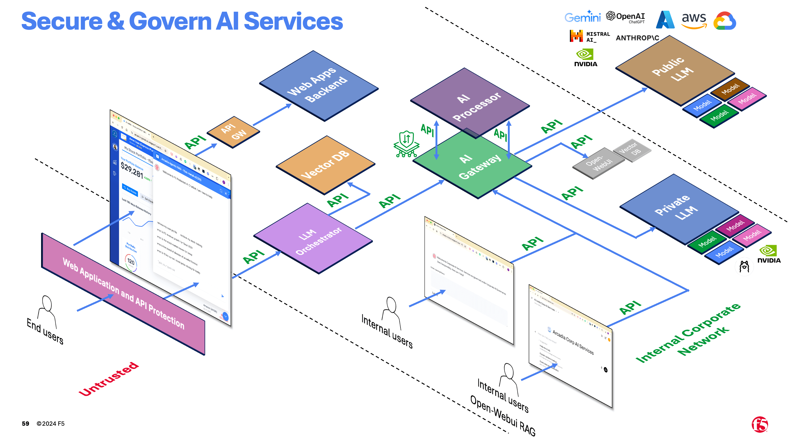
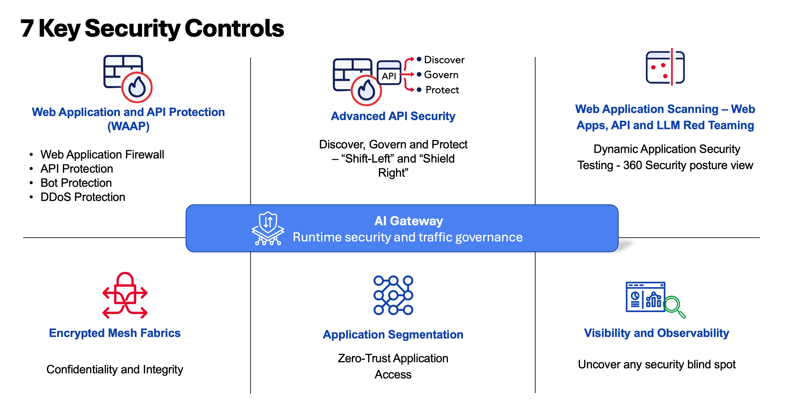

# 第五課：GenAI 聊天機器人的防護、交付與優化

以下是 AI 服務（AI Services）常見的組成元件與參考架構（Reference Architecture）。本課將介紹其中部分元件。

這是本課所用的 AI 參考架構實作。

AI 服務與應用是現代應用程式的一部分。要保護 AI 應用程式，必須採取端到端的整體方法。**若未保護底層的 Web 應用與 API，也無法徹底保護 AI 應用。** AI 服務由 API 驅動，而 API 是這些系統的骨幹。保護 API 對於維持 AI 服務的完整性與可靠性至關重要。以下為確保現代 Web 應用、API 與 AI 服務整體安全的 7 大關鍵安全控制。

本課僅聚焦於 AI Gateway（AI 閘道）安全控制——執行時安全（Runtime Security）與流量治理（Traffic Governance）。如需深入探討其他控制，請洽詢。

## 1 - F5 AI Gateway 基礎
F5 AI Gateway 會將生成式 AI 流量導向合適的 LLM（大型語言模型, Large Language Model）或 SLM（小型語言模型, Small Language Model）後端，並防護流量免於常見威脅，包括：

- 檢查並過濾用戶端請求與 LLM 回應
- 阻止惡意輸入到達 LLM 後端
- 確保 LLM 回應安全無虞
- 防止敏感資訊外洩
- AI Gateway 由兩大元件組成：
  - AI Core
  - AI Processor

### AI Core
AI Core 是專為生成式 AI 流量設計的代理伺服器，會利用一個或多個 Processor（處理器）來實現流量防護。

AI Gateway Core 處理送往 LLM 後端的 HTTP(S) 請求，執行下列任務：

- 進行 Authn/Authz（身份驗證與授權）檢查，例如驗證 JWT（JSON Web Token）與檢查請求標頭
- 解析並執行用戶端請求的基本驗證
- 對進入請求套用 Processor，可能修改或拒絕請求
- 選擇並將請求導向合適的 LLM 後端，並轉換請求／回應格式
- 對 LLM 回應套用 Processor，可能修改或拒絕回應
- 可選地，將每筆請求／回應與各 Processor 活動存成可稽核紀錄，並可匯出到 AWS S3 或 S3 相容儲存空間
- 產生並匯出可觀測性資料（Observability Data），例如 OpenTelemetry
- 提供 API 與設定檔的組態介面

### AI Processor
