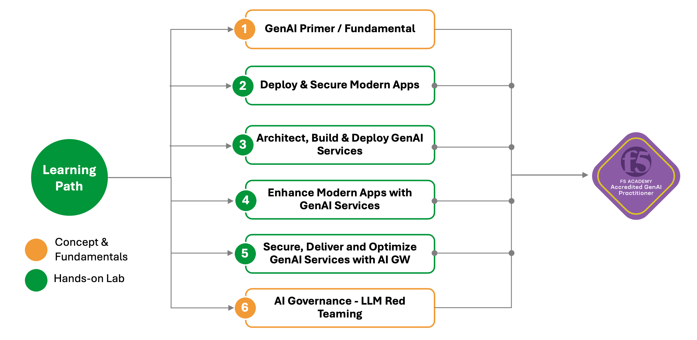

# 簡介 - GenAI 實踐者

GenAI（生成式人工智慧）技能與專業知識對現今與未來的組織至關重要。組織必須確保任何部署的 GenAI 元件都能安全且最佳化，以符合組織整體的 AI 策略。

作為一位 GenAI 實踐者，你的任務是確保現代生成式 AI 應用程式的安全、交付與優化。這包含理解、開發、保護並應用生成式 AI 模型與技術，解決問題或創造創新解決方案以推動業務成果。這個角色結合了技術專業、創造力與領域知識，來發揮如 GPT、DALL-E、Stable Diffusion 等生成式 AI 技術的潛能。你將成為組織中關鍵的業務推動者。

> **注意：** 模型開發／建立（如訓練與模型微調）不在本任務／課程範圍內。然而，AI 治理（AI Governance）、LLM Red Teaming 及模型持續測試將會被討論與展示。

## 學習路徑
要成為 GenAI 實踐者，你至少需要依照下方的學習路徑進行。每個任務／課程都會有一系列實作實驗。

> **注意：** F5 產品家族，包括 BIG-IP、NGINX 和 Distributed Cloud (XC) 服務，為組織提供全面性的生成式 AI 解決方案。**每個產品都提供了不同的價值主張**，解決了關鍵的挑戰，如可擴展性、安全性、網路和部署。為了本課程的目的，我們將主要關注於 **使用 NGINX 和 F5 的 AI Gateway 來保護、交付和優化生成式 AI 應用程式。**
